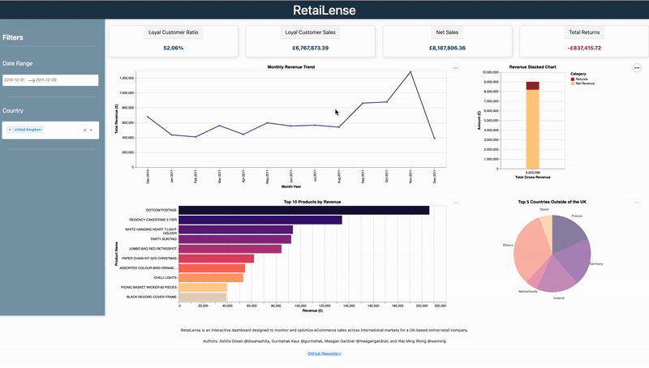

# RetaiLense

Authors: Ashita Diwan @diwanashita, Gurmehak Kaur @gurmehak, Meagan
Gardner @meagangardner, and Wai Ming Wong @waiming

## About RetaiLense

**RetaiLense** is an interactive dashboard designed to help a UK-based
online retail company monitor and optimize eCommerce sales across
international markets. It provides actionable insights into global
revenue, seasonal trends, top-selling products, and regional
performance. By analyzing product demand, return rates, and
country-specific data, users can identify growth opportunities, make
informed decisions, and fine-tune sales strategies for international
expansion.

## Motivation

### Problem:

Retail businesses often face challenges in quickly analyzing and
visualizing their sales data. Without clear insights, it becomes
difficult to spot trends, track top-performing products, and understand
revenue patterns across different countries and time periods.

### Solution:

RetaiLense offers an intuitive dashboard that makes it easy to explore
retail data through a variety of visualizations, enabling data-driven
decision-making. Key features include:

-   Bar charts highlighting top products by revenue
-   Line charts showing revenue trends over time
-   Stacked bar charts illustrating refunds and net revenue
-   Pie chart visualizing the geographic distribution of sales
-   Metric cards displaying key performance indicators (KPIs)

### How to use this app

The dashboard includes interactive filters to customize your view:

-   Date Range: Filter data by specific time periods
-   Country Selection: Focus on specific regions or compare countries
-   Dynamic Visualizations: All charts and metrics update automatically
    based on the selected filters



With RetaiLense, businesses can easily monitor their performance,
uncover trends, and make smarter decisions to optimize international
sales.

## Running the dashboard locally

### 1. Clone the repository

``` bash
git clone https://github.com/UBC-MDS/DSCI-532_2025_9_RetaiLense.git
cd DSCI-532_2025_9_RetaiLense
```

### 2. Create a virtual environment and activate it

``` bash
conda env create -f environment.yml
conda activate retailense
```

### 3. Render the dashboard locally

``` bash
python -m src.app
```

### 4. Click on the link from the output or copy and paste it into a browser to view the dashboard

Your output should look something like below. The exact numbers may be
different.

``` bash
Dash is running on http://127.0.0.1:8050/
```

## How can I get involved?

If you have any feedback or input for our team, please get into contact
with us by creating a [new
issue](https://github.com/UBC-MDS/DSCI-532_2025_9_RetaiLense/issues/new).
More instructions on contributing can be found
[here](https://github.com/UBC-MDS/DSCI-532_2025_9_RetaiLense/blob/main/CONTRIBUTING.md).
Please abide by our [code of
conduct](https://github.com/UBC-MDS/DSCI-532_2025_9_RetaiLense/blob/main/CODE_OF_CONDUCT.md)
when contributing to our project.
